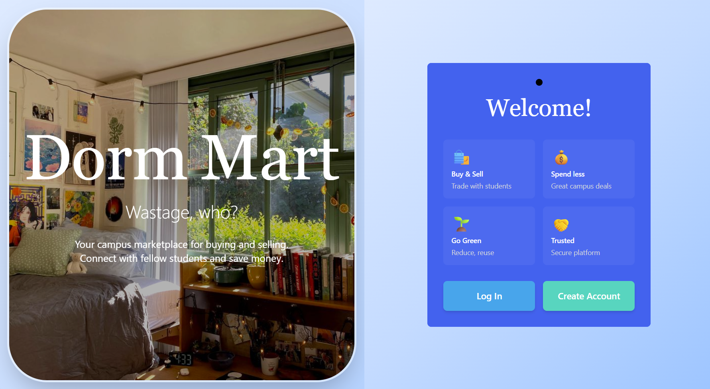
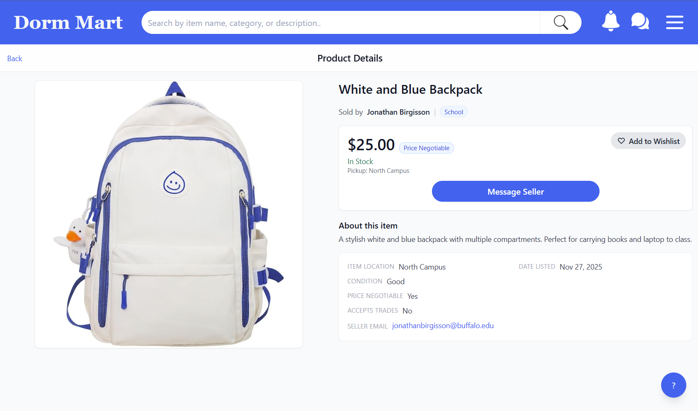
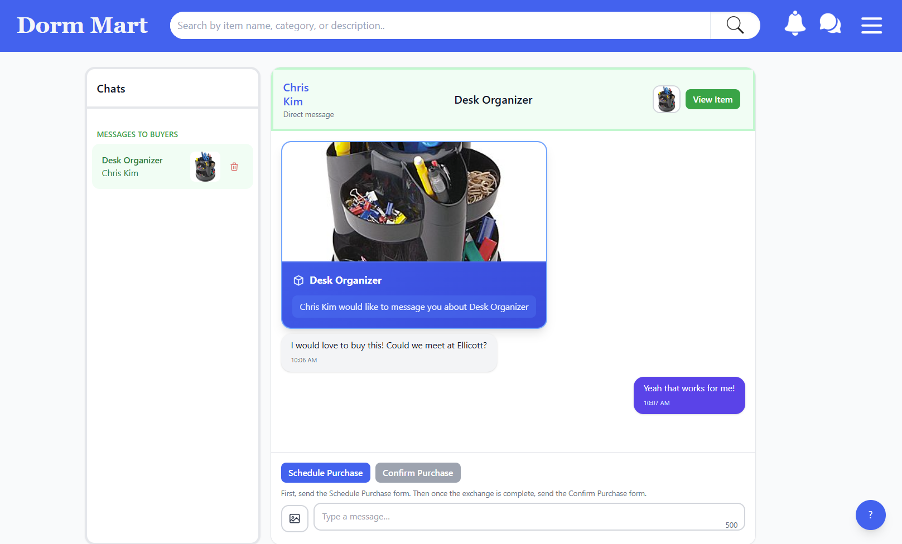

# CSE442 Fall 2025 "No Brainers" Group Project

This repository contains the "Dorm Mart" web application, built with a React frontend and a PHP backend with XAMMP.

_Created for CSE-442: Software Engineering Concepts, The University at Buffalo._

## IMPORTANT: For users without a UB account wanting to demo the site:
**Username:** `testuser@buffalo.edu`

**Password:** 1234!

# Dorm Mart: The Complete Student Marketplace

Dorm Mart is a student-to-student marketplace
that makes it effortless to buy and sell campus
essentials—textbooks, dorm gear, electronics, and
more. Create listings in minutes, track interest
and views, and manage sales from a clean,
mobile-friendly dashboard. Built for safety and
simplicity, Dorm Mart helps students save money,
reduce waste, and find what they need
within a familiar, school-centered community
experience.

With instant messaging and a review system, students can communicate
safely and build trust within their campus network. The platform
supports everything from wishlists to scheduled purchases,
making it easy to coordinate pickups and manage your entire selling
workflow in one place!

## Gallery

### Welcome Page

### Product Listings

### Chat Interface

## Features

- **Product Listings** - Create and manage product listings with images
- **Search & Filters** - Advanced search with category, condition, location, and price filters
- **Real-time Chat** - Instant messaging with typing indicators
- **Seller Dashboard** - Manage listings, sales, and ongoing purchases
- **Scheduled Purchases** - Coordinate future pickups with buyers
- **Reviews & Ratings** - Rate products and buyers
- **Wishlist** - Save favorite items and get notifications
- **Purchase History** - Track all transactions with receipts
- **Robust Security** - Protections against XSS and SQL injections, encryptions, and much more

## Tech Stack

**Frontend:** React 19, React Router, Tailwind CSS  
**Backend:** PHP 8+, MySQL  
**Auth:** PHP sessions, bcrypt password hashing  
**Security:** Prepared statements (SQL injection), XSS filtering + encoding, CORS, CSRF tokens  
**Real-time:** HTTP polling (250ms) for chat and typing indicators  
**Email:** PHPMailer  
**Dev Server:** XAMPP (Apache + MySQL)

## Production Server

**Check out the latest production release on UB Wifi: https://cattle.cse.buffalo.edu/CSE442/2025-Fall/cse-442j/#/login**

_You can also view the test server on UB Wifi: https://aptitude.cse.buffalo.edu/CSE442/2025-Fall/cse-442j/#/login_

## Key Folders

- `dorm-mart/src/` — React frontend (pages, components, context)
- `dorm-mart/api/` — PHP backend endpoints (auth, chat, seller-dashboard, reviews, etc.)
- `dorm-mart/api/security/` — Security utilities (XSS protection, SQL injection prevention)
- `dorm-mart/public/` — Static assets
- `dorm-mart/migrations/` — Database construction files

For local setup and deployment details, see `README.project_setup.md`.

For detailed setup instructions, deployment guides, and production build steps, see `README.project_setup.md`.

# For users without a UB account for demoing:
**Username:** `testuser@buffalo.edu`

**Password:** 1234!

# Development Team

**- Sooseok Kim**

**- Sameer Jain**

**- Anish Banerjee**

### Special Thanks:

- Professor Matt Hertz
- Our Usability Testers
- Former Team Developers
- The Wonderful CSE442 Teaching Assistants
